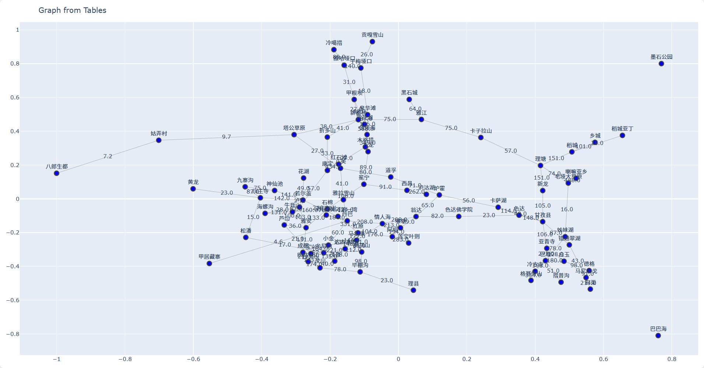
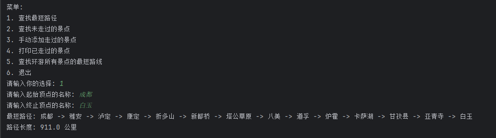
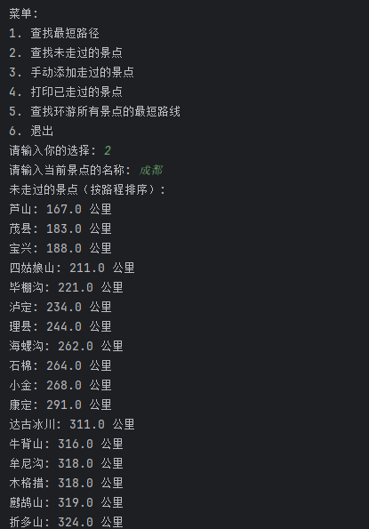

# 景区路径规划系统

## 项目简介
本项目是一个基于Python的景区路径规划系统，使用NetworkX进行图论计算和Plotly进行可视化展示。系统能够帮助游客规划景区游览路线，包括查找最短路径、记录已游览景点、推荐未游览景点以及计算环游所有景点的最短路线等功能。

## 项目结构
```
景区路径问题/
├── edges.xlsx            # 景区边信息（路径连接关系）
├── nodes.xlsx           # 景区节点信息（景点数据）
├── screenshots/         # 示例截图目录
│   ├── graph_visualization.png
│   ├── shortest_path_demo.png
│   └── unvisited_attractions.png
├── scenic_path_v0.py    # 项目早期版本代码
├── scenic_path_v1.py    # 项目主程序（当前版本）
├── visited.xlsx         # 已游览景点记录
├── 文字转表格.py        # 辅助工具（数据预处理）
└── 项目结构图.png       # 项目结构示意图
```

## 功能特性

### 1. 景区地图可视化
- 从Excel文件读取节点和边数据
- 生成交互式景区地图可视化
- 显示景点名称和路径距离



### 2. 路径规划功能
- **最短路径查询**：查找两个景点之间的最短路径
- **未游览景点推荐**：基于当前位置推荐未游览景点（按距离排序）
- **环游路线规划**：计算从起点出发游览所有景点的最短路线（TSP问题）





> 注：环游路线规划功能由于采用回溯算法，在景点数量较多时计算耗时较长，暂未提供示例截图。建议在实际使用中景点数量控制在10个以内。

### 3. 游览记录管理
- 手动添加已游览景点
- 查看已游览景点列表
- 自动排除已游览景点推荐

## 使用说明

### 运行环境
- Python 3.6+
- 必要库：`pandas`, `networkx`, `plotly`, `openpyxl`

安装依赖：
```bash
pip install pandas networkx plotly openpyxl
```

### 使用方法
1. 准备数据：
   - `nodes.xlsx`：包含景点信息（序号、顶点名称）
   - `edges.xlsx`：包含路径信息（起始节点、终止节点、权重/公里）

2. 运行程序：
```bash
python scenic_path_v1.py
```

3. 选择功能：
   - 1: 查找最短路径
   - 2: 查找未走过的景点
   - 3: 手动添加走过的景点
   - 4: 打印已走过的景点
   - 5: 查找环游所有景点的最短路线
   - 6: 退出

## 数据格式要求

### nodes.xlsx
| 序号 | 顶点名称 |
|------|----------|
| 1    | 景点A    |
| 2    | 景点B    |
| ...  | ...      |

### edges.xlsx
| 起始节点 | 终止节点 | 权重(公里) |
|----------|----------|------------|
| 1        | 2        | 1.5        |
| 2        | 3        | 2.0        |
| ...      | ...      | ...        |

### visited.xlsx（自动生成）
| 已走过 |
|--------|
| 1      |
| 3      |
| ...    |

## 算法说明
- **最短路径**：使用Dijkstra算法
- **环游路线**：使用回溯算法解决旅行商问题(TSP)（注：景点数量多时性能有限）
- **布局算法**：使用NetworkX的spring_layout进行可视化布局

## 未来改进
1. 增加更高效的TSP求解算法（如动态规划或近似算法）
2. 添加用户界面（Web或桌面应用）
3. 支持实时路径更新和多人协作记录
4. 集成地图API提供更精确的路径计算
5. 优化环游路线算法性能

## 作者信息
[XiaZhiMiao]
[xia_12_13]
[2025/4/19]